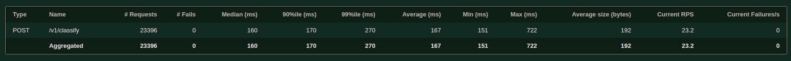

# A3 - api-iris-classifier

This is a microservice developed for Iris classification challenge.

## Process Train

### MlFlow

To run, you need to install MlFlow and run the server locally:

```console
conda create -n mlflow python=3.9 -y
conda activate mlflow
pip install mlflow==2.9.2
```

To execute, run the command:

```console
mlflow ui --port 8081 --backend-store-uri sqlite:///mlruns.db
```

The server will be running locally on [http://localhost:8081/](http://localhost:8081/).

### Train

To run training, create an environment and install training dependencies:

```console
conda create -n iris-train python=3.9 -y
conda activate iris-train
pip install -r requirements-train.txt
```

Then, simply run the notebook available at `notebooks/TrainModel.ipynb` or run the script:

```console
python train/train.py
```

## Process Execution

### Local

For both approaches it is necessary to have MlFlow running locally [http://localhost:8081/](http://localhost:8081/).

#### Conda

To learn more and how to install Conda, visit [link](https://conda.io/projects/conda/en/latest/user-guide/install/index.html).

First, go to the main project folder, create the environment locally and install the dependencies:

```console
conda create -n iris-api python=3.9 -y
conda activate iris-api
pip install -r requirements.txt
```

Download the MlFlow Inference Model:

```console
export MODE_DEPLOY="prod" && python -m v1.modules.download_model
```

Finally, run the application:

```console
export PORT=9191 && export MODE_DEPLOY=prod && export TAG=1.0.0 && export LOGLEVEL=DEBUG && gunicorn --bind 0.0.0.0:$PORT --workers 1 --threads 2 --preload main:app
```

#### Docker

First, install the [Docker](https://docs.docker.com/engine/install/) and [docker-compose](https://github.com/docker/compose)

Then go to the main project folder and run the command:

```console
docker-compose up -d
```

At the end of the process, the container will be running in [http://localhost:9191/](http://localhost:9191/)

### Google Cloud Run

#### Upload Image to Registry

To upload the image, make sure that the image has already been built with docker-compose and that you already have the gcloud-cli environment configured locally for your project [link](https://cloud.google.com/sdk/docs/install?hl=pt-br). You also need to have the Container Registry and Cloud Run enabled for your project.

Rename your image:

```console
docker tag api-iris-classifier_server:latest gcr.io/{PROJECT_ID}/api-iris/api-iris-classifier:local
```

Authenticate docker to gcloud:

```console
gcloud auth configure-docker
```

Then upload the image.

```console
docker push gcr.io/{PROJECT_ID}/api-iris/api-iris-classifier:local
```

Finally, deploy it:

```console
gcloud run deploy api-iris-classifier \
--allow-unauthenticated \
--platform=managed \
--image gcr.io/{PROJECT_ID}/api-iris/api-iris-classifier:local \
--port 8080 --region us-central1 --cpu 1 --memory 512Mi --concurrency 2 --env-vars-file clouddeploy.yml
```

## Process Inference

### Request

To perform a classification, make a POST request to the address [http://localhost:9191/v1/classify](http://localhost:9191/v1/classify) passing the following json as an example in the body of the request:

```json
{
  "sepal_length": 7.7,
  "sepal_width": 2.6,
  "petal_length": 6.9,
  "petal_width": 2.3
}
```

### Responses

#### Success

Example of success in the classification process:

```json
{
  "message": "success",
  "data": {
    "pred_confidence": 0.9999982296410712,
    "pred_label": "Iris-virginica",
    "model_version": "d70530a7e91341859659e94605146a3b"
  },
  "error": null,
  "version": "1.0.0"
}
```

#### Error

Example of error when the payload does not accord with the pattern request:

```json
{
  "message": "failed",
  "data": null,
  "error": {
    "raised": "ValidationError",
    "raisedOn": "ApiClassify",
    "message": "1 validation error for ClassifyPayload\nsepal_length\n  field required (type=value_error.missing)",
    "code": "400"
  },
  "version": "0.0.0"
}
```

## Load Test

To do the load test in the deployment environment, you need to install [locust](https://locust.io/).
Create the environment and install it. In the `locust/locust.py` directory, rename the `uri` variable to the deployed endpoint.
Next, run locust and perform the load test by opening the interface on [http://localhost:8089](http://localhost:8089)

```console
locust -f ./locust/locust.py -H http://127.0.0.1:5000
```

### Results

For the test with the instance I configured and with a maximum of 50 simultaneous users during 30min, the result was as follows:


